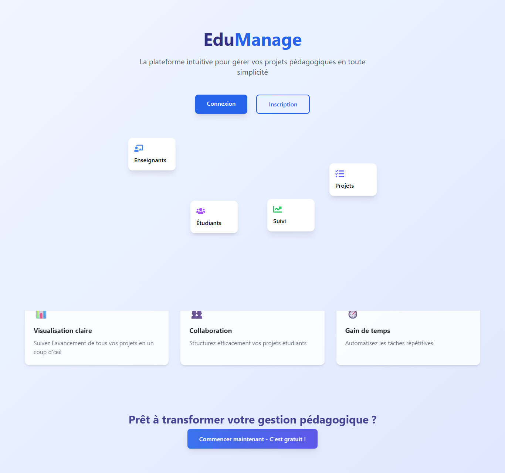
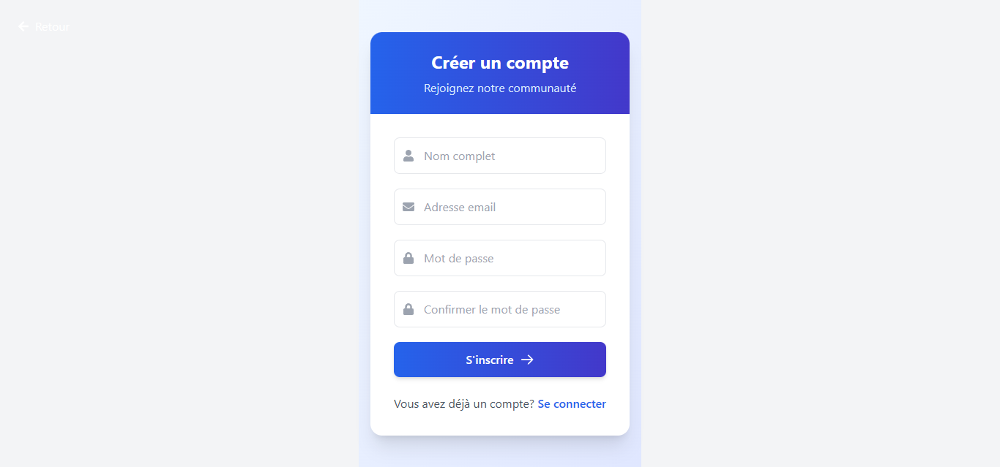
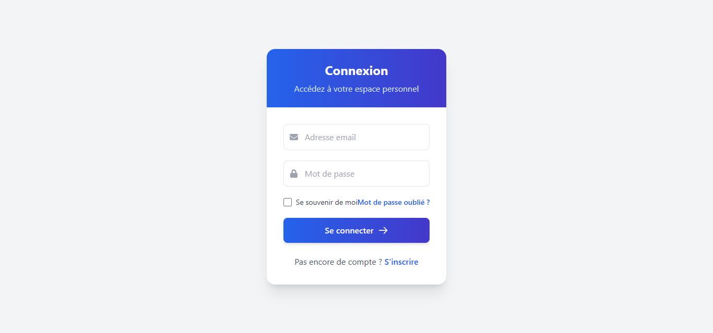
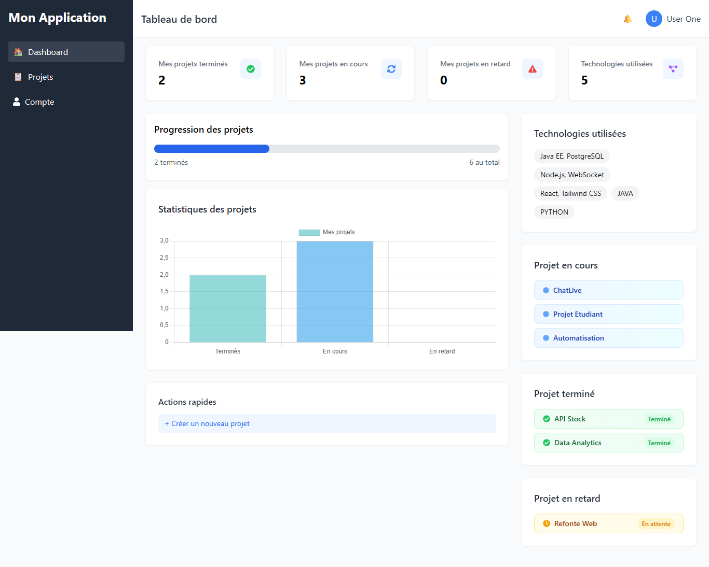
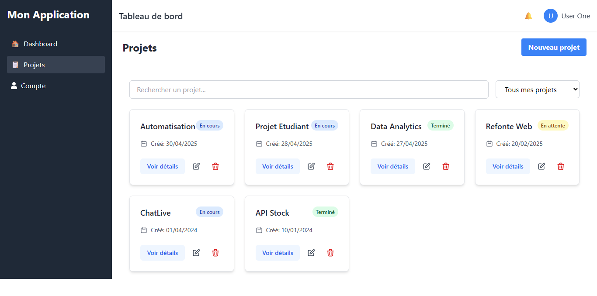
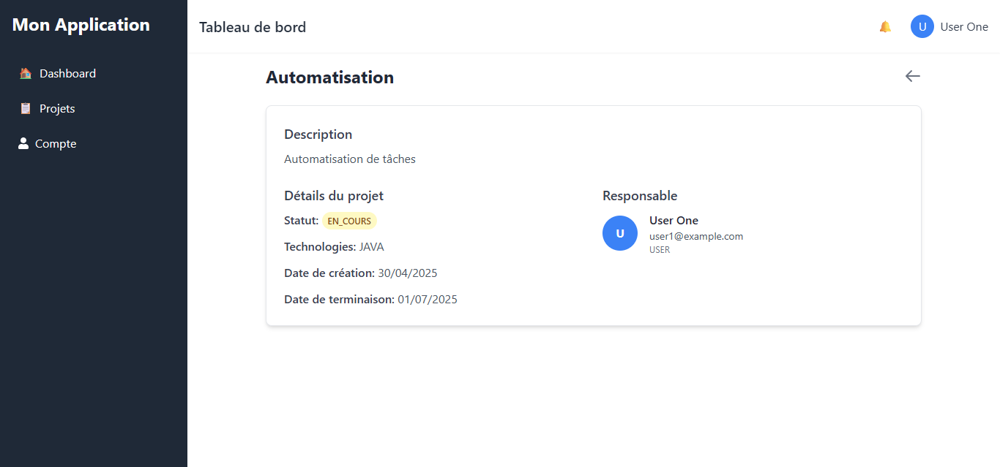
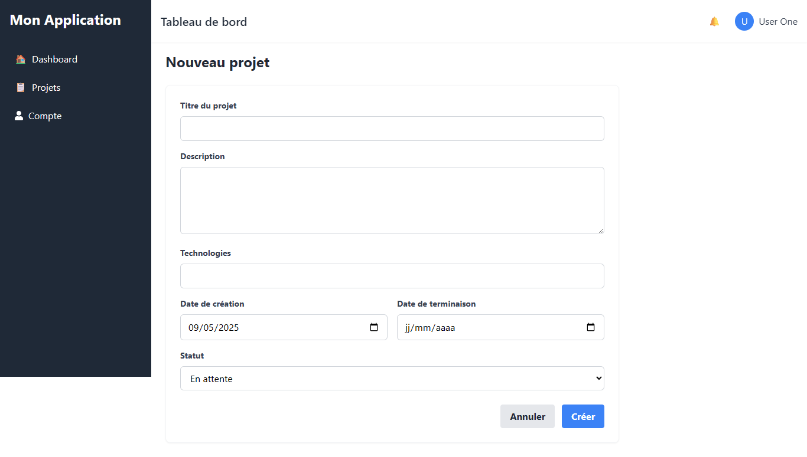
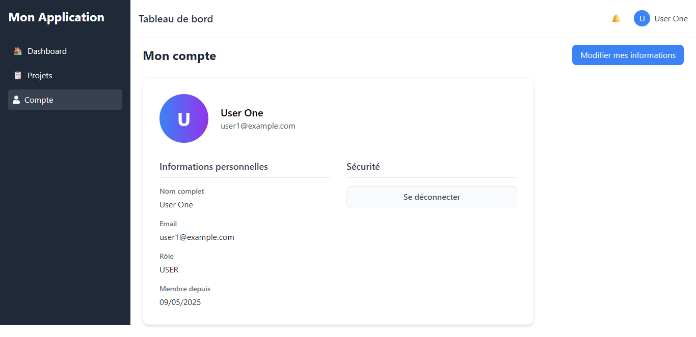

Projet de gestion de projet pour developpeur 

# Gestion de Projets / Frontend seulement - Captures d'écran

## Flux de l'application

### 1. Page d'acceuil
  
*Interface acceuil du projet*

---

### 2. Page d'inscription
  
*Interface pour créer un nouveau compte*

---

### 3. Page de connexion
  
*Formulaire d'authentification*

---

### 4. Tableau de bord
  
*Vue d'ensemble des projets*

---

### 5. Liste des projets
  
*Affichage de tous les projets*

---

### 6. Détails d'un projet
  
*Informations spécifiques sur un projet*

---

### 7. Formulaire d'ajout
  
*Création d'un nouveau projet*

---

### 8. Profil utilisateur
  
*Gestion du profil*
